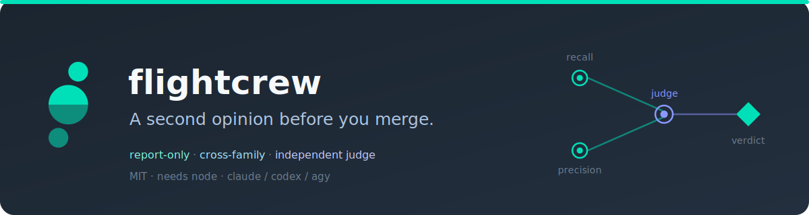

# preflight-skills

<p align="center"></p>


**A second opinion before you merge — multi-model code review for coding agents.** An independent multi-model review crew for your coding agent:
two blind parallel reads of a diff, design doc, or writing draft by different model families, then an
independent judge that filters false positives. Report-only — it never merges, fixes, or acts.

> Installed as the `preflight` plugin (skills: `crew-review`, `crew-consult`, `biascheck`, `unbias`). Repo: `akasecurity/preflight-skills`.

Four skills ship: `crew-review` and `crew-consult` review code and design docs; `biascheck` scores a
writing draft for authenticity with a neutral median scorer (several reads by `gpt-5.6-terra`, median
reported), report-only and never editing it. `unbias` is the odd one out — a prompt-only skill where
the session model applies the tells catalog in place, not part of the crew engine. The two de-slop
skills read different catalogs: `unbias` uses `shared/BIAS.md` (a forgiving self-editing catalog),
`biascheck` uses `shared/TELLS.md` (a detection-oriented research reference).

From [akasecurity](https://akasecurity.io) · MIT · needs `node` · drives `claude` / `codex` / `agy`.

## Quick start

Claude Code:

```
/plugin marketplace add akasecurity/marketplace
/plugin install preflight@akasecurity
```

Codex:

```
codex plugin marketplace add akasecurity/marketplace
codex plugin add preflight@akasecurity
```

Antigravity (`agy`) — direct repo install (no marketplace step):

```
agy plugin install https://github.com/akasecurity/preflight-skills
```

Other harnesses (Cursor, Gemini, Kimi, OpenCode, Pi) install from this repo too — see the
[marketplace](https://github.com/akasecurity/marketplace). Standalone CLI, no coding agent:
`brew install akasecurity/tap/preflight`.

Then, in any repo:

```
/crew-review main...HEAD
/crew-consult docs/design.md
/biascheck drafts/post.md
/unbias drafts/post.md
```

## How it works

1. **Packet** — the target (a git range or a file) is turned into a ground-truth packet: a diff or
   a doc/draft body plus an anchor.
2. **Two blind reads** — two model seats from different families read the identical packet in
   parallel, blind to each other. One is RECALL-tuned (report everything suspicious, false
   positives expected), the other PRECISION-tuned (only cite-grounded findings).
3. **Judge** — a third, independent seat forms its own opinion of the packet first, then weighs
   both reads: it discards clear false positives and flags anything both reads missed. It is a
   **judge, not a vote counter** — reviewer agreement doesn't bind it. That's the differentiator.
4. **Report** — printed to stdout. The `CREW:` line names every seat (`role=family:tune`). Nothing
   is written into the reviewed repo.

`biascheck` does NOT use this two-reads-plus-judge pipeline. It is a **neutral median scorer**: N
independent reads (default 3) by one model (`gpt-5.6-terra@medium`) each score the draft 0-100 against
`shared/TELLS.md`, and the report prints `AUTHENTICITY: <median>/100` with the score spread (higher =
reads more human; a signal, not a verdict). A single read is noisy, so the median and spread are both
shown. The draft itself is never edited.

Anchors pin freshness so a stale report is stale on its face: `crew-review` pins the git SHA of
the range's endpoint; `crew-consult` and `biascheck` pin the sha256 of the target file's bytes. The
anchor prints at the top and bottom of every report. A file-anchored report's anchor is the sha256
of the file's exact bytes, so a non-UTF-8 doc is pinned precisely; the packet body the models read
is a lossy UTF-8 rendering of those bytes.

`unbias` sits outside this pipeline entirely: it's a prompt-only skill where the session model
applies the tells catalog at `shared/BIAS.md` in place, with no script run and no separate model
calls. Run `unbias` for the fast, everyday de-slop pass; run `biascheck` when you want an
independent authenticity score.

Exit codes: `0` a report was produced with at least one completed read seat · `1` a mechanical
failure (no model CLI found, bad range, empty diff, unreadable file, or all read seats timed out /
errored — the report still prints in this case) · `2` a usage error (bad flags/arguments).

The reviewed repo is never touched. Writes are limited to `~/.preflight/` (telemetry: every model
call appends one line to `modelcalls.jsonl` with timing + outcome, no tokens, for backend-health
tracking) and, when a google seat runs, a temporary packet file in the OS temp directory (removed on
success, kept on a timeout or error as a debug artifact).

The telemetry home is `~/.preflight/` by default; set `CREW_HOME` to redirect it (telemetry then
lands in `$CREW_HOME/.preflight/modelcalls.jsonl`). Nothing else honors `CREW_HOME`.

## CLI

```
crew.mjs review <git-range>  [--item <label>] [--read family[:tune] ...] [--judge family[:model]] [--timeout <sec>]
crew.mjs consult <file>      [same flags]
crew.mjs biascheck <file>    [--reads <n>] [--read family[:tune]] [--item <label>] [--timeout <sec>]
```

**Defaults:** `--judge` defaults to `claude:opus` when the claude CLI is present; otherwise the
first available family (attributed on the report's `CREW:` line). `--timeout` defaults to `600`
seconds per seat.

For `openai`, `tune` is `effort` or `effort:model` (either half may be blank to take its role
default): read seats default to `gpt-5.6-terra` at `medium` effort, the judge seat defaults to
`gpt-5.6-sol` at `low` effort. Override effort only with `--read openai:high`, or pin a model too
with `--read openai:high:gpt-6-preview`. The resolved `model@effort` prints on the report's `CREW:`
line (e.g. `precision=openai:gpt-5.6-terra@medium`). Bump these constants in `bindingFor` (and this
line) as OpenAI ships new models — there's no auto-discovery.

With no `--read` flags, the script detects installed model CLIs on `PATH` for this run and prefers
a cross-family crew. With exactly one family installed, it falls back to an intra-family mix (two
tunes of that one family) and the report notes it's same-family. With none installed, it prints
install pointers for `claude`, `codex`, and `agy`, and exits `1`.

## Model families

| family | CLI | packet delivery | read-only profile | status |
|---|---|---|---|---|
| claude | `claude` | stdin | `--allowedTools Read Grep Glob` | live-verified 2026-07-08 |
| openai | `codex` | stdin | `--sandbox read-only` | live-verified 2026-07-09 |
| google | `agy` | temp-file pointer (agy takes the prompt as an argument, not stdin) | `agy --sandbox` = terminal restrictions, not strict read-only — the report notes this whenever a google seat runs | live-verified 2026-07-08 |

`--print-timeout` is pinned to the run's `--timeout` for the google seat.

Platform: macOS/Linux (POSIX). Windows is untested — CLI detection and spawn shapes assume a POSIX PATH.

## Install per harness

- **Claude Code** (fleet-exercised) — marketplace install, see Quick start above.
- **Codex** (fleet-exercised) — via its plugin manifest dir (`.codex-plugin/`).
- **Gemini / Antigravity** (fleet-exercised) — via `gemini-extension.json` / `GEMINI.md`.
- **Others** (community-tested, mirrored from superpowers' manifest shapes) — OpenCode
  (`.opencode/`), Cursor (`.cursor-plugin/`), Kimi (`.kimi-plugin/`), Pi (`.pi/`).
- **Any harness, manually** — clone the repo and point your harness at `skills/`; each skill is a
  self-contained `SKILL.md` that resolves `scripts/crew.mjs` relative to its own base directory.

## How this differs

- **gstack** `/review` + `/codex` — sequential second-opinion review with a side-by-side compare;
  explicitly no arbitration or judge logic; can gate shipping and auto-fix.
- **gsd-core** `gsd:review` — cross-CLI blind review, but plans only; a consensus tally, not a
  judge; can auto-replan.
- **formin / multi-model-review** — a sequential handoff where one model writes the spec and plan,
  another implements, a third reviews; scoped to spec-kit.
- **ccg-workflow** — a write-capable multi-model build pipeline where the author model synthesizes
  its own audit.

preflight-skills is report-only, cross-family by default, and its judge is an independent third
opinion — not a tally of the first two.

## Works well with

- **superpowers** — run `crew-review` at its requesting-code-review step.
- **spec-kit** — `crew-consult plan.md` before building; `crew-review` the implement diff after.
- **gsd** — feed phase plans to `crew-consult` before executing them.

### FAQ

**Does it change my code?** No. It prints a report to stdout and writes nothing into the reviewed
repo. The only writes are local telemetry and a temporary packet file.

**Which models does it use?** Two seats from different families for the reads and a third
independent seat as judge, driving the `claude`, `codex`, and `agy` CLIs you already have.

**What if only one model family is available?** It degrades loudly to a same-family crew and says
so on the report's face.

**Is my code sent anywhere new?** No. Only to the model CLIs you already use and have authenticated;
preflight adds no new network destination.

## License

MIT
