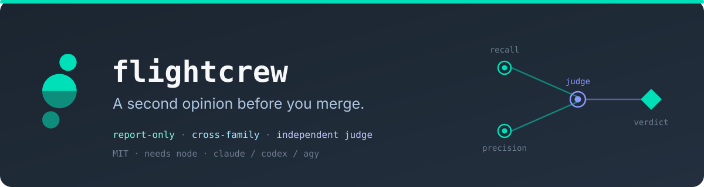

# preflight-skills

<p align="center"></p>


**A second opinion before you merge — multi-model code review for coding agents.** An independent multi-model review crew for your coding agent:
two blind parallel reads of a diff, design doc, or writing draft by different model families, then an
independent judge that filters false positives. Report-only — it never merges, fixes, or acts.

> Installed as the `preflight` plugin (skills: `crew-review`, `crew-consult`, `biascheck`, `unbias`, `secure-research`, `multiplechoice`, `experiment`, `priorart`). Repo: `akasecurity/preflight-skills`.

Eight skills ship: `crew-review` and `crew-consult` review code and design docs; `biascheck` scores a
writing draft for authenticity with a neutral median scorer (several reads by one model, median
reported), report-only and never editing it. `unbias` is the odd one out — a prompt-only skill where
the session model applies the tells catalog in place, not part of the crew engine. The two de-slop
skills read different catalogs: `unbias` uses `shared/BIAS.md` (a forgiving self-editing catalog),
`biascheck` uses `shared/TELLS.md` (a detection-oriented research reference). `secure-research` is
separate from the review crew: cited web research spread across several search engines (see
[secure-research](#secure-research) below). `multiplechoice` is also prompt-only and outside the crew: it turns
the decisions you need to make, including the calls an agent made on your behalf, into
multiple-choice questions with the agent's recommendation first (see
[multiplechoice](#multiplechoice) below). `experiment` and `priorart` are prompt-only checklists for two
moments before you commit to something: measuring instead of arguing, and looking for what already
exists before building it (see [experiment and priorart](#experiment-and-priorart) below).

From [akasecurity](https://akasecurity.io) · MIT · needs `node` · drives `claude` / `codex` / `agy`.

## Quick start

Claude Code:

```
/plugin marketplace add akasecurity/marketplace
/plugin install preflight@akasecurity
```

Codex:

```
codex plugin marketplace add akasecurity/marketplace
codex plugin add preflight@akasecurity
```

Antigravity (`agy`) — direct repo install (no marketplace step):

```
agy plugin install https://github.com/akasecurity/preflight-skills
```

Other harnesses (Cursor, Gemini, Kimi, OpenCode, Pi) install from this repo too — see the
[marketplace](https://github.com/akasecurity/marketplace). Standalone CLI, no coding agent:
`brew install akasecurity/tap/preflight`.

Then, in any repo:

```
/crew-review main...HEAD
/crew-consult docs/design.md
/biascheck drafts/post.md
/unbias drafts/post.md
```

## How it works

1. **Packet** — the target (a git range or a file) is turned into a ground-truth packet: a diff or
   a doc/draft body plus an anchor.
2. **Two blind reads** — two model seats from different families read the identical packet in
   parallel, blind to each other. One is RECALL-tuned (report everything suspicious, false
   positives expected), the other PRECISION-tuned (only cite-grounded findings).
3. **Judge** — a third, independent seat forms its own opinion of the packet first, then weighs
   both reads: it discards clear false positives and flags anything both reads missed. It is a
   **judge, not a vote counter** — reviewer agreement doesn't bind it. That's the differentiator.
4. **Report** — printed to stdout. The `CREW:` line names every seat (`role=family:tune`). Nothing
   is written into the reviewed repo.

`biascheck` does NOT use this two-reads-plus-judge pipeline. It is a **neutral median scorer**: N
independent reads (default 3) by one model each score the draft 0-100 against
`shared/TELLS.md`, and the report prints `AUTHENTICITY: <median>/100` with the score spread (higher =
reads more human; a signal, not a verdict). A single read is noisy, so the median and spread are both
shown. The draft itself is never edited.

Anchors pin freshness so a stale report is stale on its face: `crew-review` pins the git SHA of
the range's endpoint; `crew-consult` and `biascheck` pin the sha256 of the target file's bytes. The
anchor prints at the top and bottom of every report. A file-anchored report's anchor is the sha256
of the file's exact bytes, so a non-UTF-8 doc is pinned precisely; the packet body the models read
is a lossy UTF-8 rendering of those bytes.

`unbias` sits outside this pipeline entirely: it's a prompt-only skill where the session model
applies the tells catalog at `shared/BIAS.md` in place, with no script run and no separate model
calls. Run `unbias` for the fast, everyday de-slop pass; run `biascheck` when you want an
independent authenticity score.

Exit codes: `0` a report was produced with at least one completed read seat · `1` a mechanical
failure (no model CLI found, bad range, empty diff, unreadable file, or all read seats timed out /
errored — the report still prints in this case) · `2` a usage error (bad flags/arguments).

The reviewed repo is never touched. Writes are limited to `~/.preflight/` (telemetry: every model
call appends one line to `modelcalls.jsonl` with timing + outcome, no tokens, for backend-health
tracking). No packet file is written: every seat receives the packet on stdin, or, for agy, inline as
its prompt argument.

The telemetry home is `~/.preflight/` by default; set `CREW_HOME` to redirect it (telemetry then
lands in `$CREW_HOME/.preflight/modelcalls.jsonl`). Nothing else honors `CREW_HOME`.

## CLI

```
crew.mjs review <git-range>  [--item <label>] [--read family[:tune] ...] [--judge family[:model]] [--timeout <sec>]
crew.mjs consult <file>      [same flags]
crew.mjs biascheck <file>    [--reads <n>] [--read family[:tune]] [--item <label>] [--timeout <sec>]
```

**Defaults:** `--judge` defaults to `claude:opus` when the claude CLI is present; otherwise the
first available family (attributed on the report's `CREW:` line). `--timeout` defaults to `600`
seconds per seat.

**Tiers.** Models are chosen by capability tier: `fast` (mechanical implementation), `balanced`
(integration and judgment), `extra` (architecture, design and the final review, on the top rung of
this ladder). The older names `cheap` / `standard` / `most-capable` still work as aliases. For
`claude`, a tier name resolves to the CLI's own alias (`haiku` / `sonnet` / `opus`), and an explicit
model such as `claude:<model>` passes through unchanged. Claude reads default to `balanced` at minimum,
and the claude recall read and judge default to `extra`. For Codex the dispatching agent states the model
and effort it picked from `codex debug models`; a blank half leaves the Codex CLI's own default, so no tier
floor is enforced by the scripts.

For `openai`, no model id lives in the code. The agent that dispatches a codex seat reads the live
list (`codex debug models`), picks a model by capability for the tier, and passes
`--read openai:<model>@<effort>`. `tune` is `model@effort`, `effort:model` or a bare `effort`; either
half may be blank, and a blank half leaves the Codex CLI's own default in place. Nothing validates the
model: Codex's own error on an unknown slug is the check. The resolved `model@effort` prints on the
report's `CREW:` line, with `default` for an unset half.

With no `--read` flags, the script detects installed model CLIs on `PATH` for this run and prefers
a cross-family crew. With exactly one family installed, it falls back to an intra-family mix (two
tunes of that one family) and the report notes it's same-family. With none installed, it prints
install pointers for `claude`, `codex`, and `agy`, and exits `1`.

## Model families

| family | CLI | packet delivery | read-only profile | status |
|---|---|---|---|---|
| claude | `claude` | stdin | `--allowedTools Read Grep Glob` | live-verified 2026-07-08 |
| openai | `codex` | stdin | `--sandbox read-only` | live-verified 2026-07-09 |
| google | `agy` | inline `-p` argument (agy takes the prompt as an argument; while the seat runs, the process list shows it to other local users) | `agy --sandbox` = terminal restrictions, not strict read-only — the report notes this whenever a google seat runs | live-verified 2026-07-08 |

`--print-timeout` is pinned to the run's `--timeout` for the google seat.

Platform: macOS/Linux (POSIX). Windows is untested — CLI detection and spawn shapes assume a POSIX PATH.


## secure-research

Cited web research spread across several search engines. The session model splits the question into
angles, `scripts/research.mjs` runs one web researcher per angle, and the session model writes a
report in which every claim cites a source a researcher quoted.

```
/secure-research "Which self-hosted price trackers are maintained in 2026?" --engines claude,codex,agy
```

With no `--engines`, `auto` picks bare `codex` (the Codex CLI's own default model and effort) when codex is installed, else
`claude:haiku`, and the run's `warnings` say so. For the fast tier, pass `codex:<model>@<effort>` with
values from `codex debug models`. A measured comparison on the same three angles, where a quote counts
as found if the cited page contains it verbatim or shares a 6-word run with it, preceded the tier
work; its Codex row ran a fast-tier model at low effort:

| Researcher | Quote found on the cited page | Median time | Cost |
|---|---|---|---|
| `claude:haiku` | 48% | 53 s | $0.62 |
| `claude:sonnet` | 67% | 55 s | $0.75 |
| `codex:gpt-6-luna@low` (measured before the tier work; the fast tier, with the model picked from the live list) | 95% | 34 s | subscription |

Claude researchers read pages through WebFetch, which summarizes a page first, so their quotes are
often paraphrases. The Codex researcher drew on fewer distinct sites, so mixing engines still adds breadth.

| Engine | What runs | Needs |
|---|---|---|
| `claude` | `claude -p` limited to WebSearch/WebFetch, no MCP servers (your settings and hooks still apply) | Claude Code |
| `codex` | `codex --search exec`, read-only sandbox (it can still read files you can) | Codex CLI |
| `agy` | `agy -p --sandbox`, auto-approved | Antigravity CLI |
| `grok` | `grok -p`, no tool restriction verified, so never part of `all` | Grok CLI and credit |
| `searxng` | the SearXNG JSON API, then the top result pages fetched directly; verbatim excerpts, no model reads them | `SEARXNG_URL` pointing at your instance, JSON format on |

Every CLI runs in an empty temp directory, not your repo. That keeps the repo out of reach by
default, but it is not a filesystem jail. Pick a model per engine with `<engine>:<model>[@<effort>]`,
e.g. `--engines claude:haiku,claude:sonnet,codex:<model>@<effort>` compares three models on the same
angles. At most 6 researchers run at once (`--concurrency`).

`--mode rotate` (the default) gives each angle one engine, round-robin. `--mode all` runs every angle
on every engine, for cross-engine corroboration at engine-count cost. An engine that is missing, out
of credit or logged out is reported and skipped, and the run continues.

Sensitive topics (a named private person, health, legal or financial details, a specific target's
vulnerability, credentials) are gated for your approval, have identifying details redacted from the
queries, and run on `searxng` only. The engine refuses any other engine for them.

In Claude Code, `/secure-research` hands off to the `preflight:secure-research-workflow` Workflow, so
each researcher shows as its own agent and the run can resume. Its searxng, codex, agy and grok
researchers run through `research.mjs` too, so a sensitive run fails closed there when `SEARXNG_URL`
is unset (or pass `searxngUrl`). Other harnesses follow the steps in
`skills/secure-research/SKILL.md`.

## multiplechoice

```
/multiplechoice
```

Ask for it ("what decisions do I need to make, or were made for me?"), or let the agent reach for
it when two or more open decisions block the work. It collects the open decisions, the
consequential calls the agent made without asking, and the choices an experiment could settle.
Facts are checked before anything is framed, and each decision becomes a question with 2–4 options,
the recommended option first. Rounds of up to four are asked one at a time. Without a picker tool
it falls back to a numbered list you answer like `1a 2c`. Prompt-only: no script, no model calls.
See `skills/multiplechoice/SKILL.md`.

## experiment and priorart

```
/experiment
/priorart
```

Both are prompt-only, and agents reach for them on their own at the right moment.

`experiment` applies when a question could be measured instead of argued: picking a tunable,
comparing configurations, explaining a slowdown, or writing up benchmark results. It checks earlier
results and your own recent changes first. It designs a controlled, interleaved, repeated test on a
real workload and guards shared systems. It excludes contaminated runs by timeline, restores the
original config, and reports the evidence grade. A thin result comes back as "inconclusive", not a
verdict.

`priorart` applies before building a script, wrapper, cache, scheduler or integration. It searches the
project's decision log and notes, existing scripts, the components on either side (full config and
source), platform facilities, then maintained projects. The preferred order is to turn on or fix what
exists, extend it through a supported point, adopt a maintained project, and only then build. It
never edits vendored code.

## Install per harness

- **Claude Code** (fleet-exercised) — marketplace install, see Quick start above.
- **Codex** (fleet-exercised) — via its plugin manifest dir (`.codex-plugin/`).
- **Gemini / Antigravity** (fleet-exercised) — via `gemini-extension.json` / `GEMINI.md`.
- **Others** (community-tested, mirrored from superpowers' manifest shapes) — OpenCode
  (`.opencode/`), Cursor (`.cursor-plugin/`), Kimi (`.kimi-plugin/`), Pi (`.pi/`).
- **Any harness, manually** — clone the repo and point your harness at `skills/`; each skill is a
  self-contained `SKILL.md` that resolves `scripts/crew.mjs` relative to its own base directory.

## How this differs

- **gstack** `/review` + `/codex` — sequential second-opinion review with a side-by-side compare;
  explicitly no arbitration or judge logic; can gate shipping and auto-fix.
- **gsd-core** `gsd:review` — cross-CLI blind review, but plans only; a consensus tally, not a
  judge; can auto-replan.
- **formin / multi-model-review** — a sequential handoff where one model writes the spec and plan,
  another implements, a third reviews; scoped to spec-kit.
- **ccg-workflow** — a write-capable multi-model build pipeline where the author model synthesizes
  its own audit.

preflight-skills is report-only, cross-family by default, and its judge is an independent third
opinion — not a tally of the first two.

## Works well with

- **superpowers** — run `crew-review` at its requesting-code-review step.
- **spec-kit** — `crew-consult plan.md` before building; `crew-review` the implement diff after.
- **gsd** — feed phase plans to `crew-consult` before executing them.

### FAQ

**Does it change my code?** No. It prints a report to stdout and writes nothing into the reviewed
repo. The only write is local telemetry.

**Which models does it use?** Two seats from different families for the reads and a third
independent seat as judge, driving the `claude`, `codex`, and `agy` CLIs you already have.

**What if only one model family is available?** It degrades loudly to a same-family crew and says
so on the report's face.

**Is my code sent anywhere new?** No. Only to the model CLIs you already use and have authenticated;
preflight adds no new network destination.

## License

MIT
